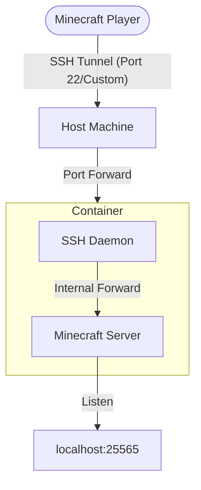

# SSH-Minecraft-Server

A secure, containerized Minecraft server that uses SSH tunneling for player access. Instead of exposing the Minecraft game port (25565) directly to the internet, players connect via a secure SSH tunnel.

# NOTE: i vibecoded this
and vibecoding kinda sucks. the AI is not good at understanding user experience for this nonstandard configuration (e.g. that users will be angry if the SSH's host key keeps rotating each restart)

## Rationale & Architecture

Typical Minecraft servers expose a raw TCP port to the public internet, which can be vulnerable to automated scanners and DDoS attacks. This project wraps the server in a Podman container and restricts access through an SSH daemon.

### Security Features:
- **No Direct Game Port Exposure**: The Minecraft port (25565) is only accessible within the container's localhost.
- **SSH Encrypted Tunneling**: All game traffic is wrapped in an SSH tunnel.
- **Hardened SSH Access**: Users are forced into a no-shell command that only keeps the tunnel alive.
- **Podman Secrets**: SSH host keys are managed via Podman secrets for persistence across container rebuilds.

### Network Diagram:



## Setup

### Prerequisites
- **Podman**: Ensure Podman is installed on your host system.
- **Java JAR**: Have a `minecraft_server.jar` ready in the project directory.

### Installation
Run the interactive setup script:

```bash
chmod +x setup.sh
./setup.sh
```

The script will guide you through:
1. Choosing a host port (e.g., 2222) to map to the server's SSH access.
2. Creating an SSH user and password.
3. Specifying where to store server data (world files, configs).
4. Building the container image.
5. (Optional) Installing a systemd user service for auto-start on boot.

## How to Connect (For Players)

To play on the server, players must first establish an SSH tunnel.

### 1. Start the SSH Tunnel
Run this command in a terminal (replace `PORT`, `USER`, and `HOST` with the server's details):

```bash
ssh -L 25565:localhost:25565 -p [PORT] [USER]@[HOST]
```

- `-L 25565:localhost:25565`: Maps your computer's port 25565 to the server container's internal port 25565.
- `-p [PORT]`: The custom SSH port you chose during setup.

Keep this terminal window open while playing.

### 2. Connect in Minecraft
- Open Minecraft.
- Go to **Multiplayer** -> **Direct Connection** (or Add Server).
- Use the address: `localhost:25565`

## Manual Tuning

### Adjusting Memory (RAM)
The Java memory limits are defined in `start_server.sh`. To change them, modify these flags:
- `-Xms2G`: Initial heap size.
- `-Xmx6G`: Maximum heap size.

After modification, you must rebuild the container or restart the service if using local mounts.

### Server Properties
The `server.properties` file and world data are stored in the host path you specified during setup (default: `/opt/minecraft`). You can edit these files directly on the host, and they will be reflected in the container.

### Interacting with the Console
To run commands (like `op`, `whitelist`, or `say`) directly on the Minecraft server console, you can attach to the running container:

```bash
podman attach ssh_minecraft_container
```

**Warning**: To detach from the console without stopping the server, use the escape sequence: `Ctrl + p` followed by `Ctrl + q`. Using `Ctrl + c` will send a SIGINT to the server and likely shut it down.

### Systemd Management
If you enabled "Start on Startup", you can manage the server using standard systemctl commands:

```bash
# View status
systemctl --user status container-ssh_minecraft_container

# Stop the server
systemctl --user stop container-ssh_minecraft_container

# View logs
podman logs -f ssh_minecraft_container
```
